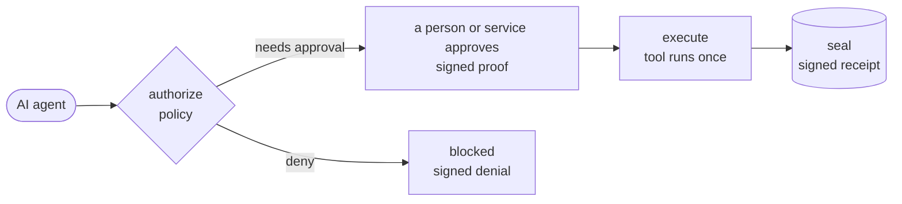

# PermitRail

[](https://github.com/chokonaira/permitrail/actions/workflows/test.yml)
[](https://www.npmjs.com/package/@permitrail/core)
[](LICENSE)
[](package.json)

**Authorization, proof, and audit for what AI agents actually do.**

Agents now send mail, move money, open pull requests, and delete data. The hard
question is no longer "can the model call the tool." It is "was this exact action
allowed, by whom, for what, and can you prove it afterward."

PermitRail sits in front of those actions. Policy decides, an approver signs off on
the exact action, a short-lived signed proof is issued, the tool runs once, and a
signed receipt lands in your audit log.



[Live sandbox](https://chokonaira.github.io/permitrail/) · [API reference](https://chokonaira.github.io/permitrail/api/) · [npm packages](https://www.npmjs.com/org/permitrail) · [Production guide](docs/production.md) · [Policy model](docs/policy.md) · [MCP server](docs/mcp.md) · [Threat model](docs/threat-model.md) · [Protocol schema](spec/permitrail.schema.json)

## Choose your package

PermitRail does not ship AI models. It ships small TypeScript packages for
different integration points, so you install only the pieces you need.

| You are building | Start with | Why |
| --- | --- | --- |
| An app or agent gateway | `npm install @permitrail/core @permitrail/mcp-gateway @permitrail/provider-webhook` | Production path for policy, approval, replay protection, and signed receipts |
| A local demo or internal prototype | `npm install @permitrail/core @permitrail/mcp-gateway @permitrail/provider-local` | Fastest way to see the proof flow without wiring an external approval service |
| A local human approval flow | `npm install @permitrail/core @permitrail/mcp-gateway @permitrail/local-approval` | Pause risky tool calls for a human to approve from a local page, with signed proofs |
| An MCP client setup | `npx @permitrail/mcp` | Run PermitRail as a stdio MCP server in Claude Desktop, Cursor, or another MCP client |
| A verifier service | `npm install @permitrail/core` | Verify proofs and receipts without running a gateway |

Most app integrations use `@permitrail/core`, `@permitrail/mcp-gateway`, and one
approval provider. MCP users can start with the runnable server.

## Package reference

Every package and its npm page, so you can see the full surface up front.

| Package | Use it when you need |
| --- | --- |
| [`@permitrail/core`](https://www.npmjs.com/package/@permitrail/core) | Protocol primitives: canonical JSON, policy checks, proofs, receipts, and Web Crypto signing |
| [`@permitrail/mcp-gateway`](https://www.npmjs.com/package/@permitrail/mcp-gateway) | An embeddable enforcement gateway with replay protection, audit receipts, and MCP-ready tool definitions |
| [`@permitrail/provider-local`](https://www.npmjs.com/package/@permitrail/provider-local) | An in-process approval provider for demos, tests, and internal tools |
| [`@permitrail/local-approval`](https://www.npmjs.com/package/@permitrail/local-approval) | A localhost approval server and page for human-in-the-loop approval of agent tool calls (demos and internal tools) |
| [`@permitrail/provider-webhook`](https://www.npmjs.com/package/@permitrail/provider-webhook) | A production approval bridge to your own HTTPS endpoint, Slack bot, risk engine, or approval service |
| [`@permitrail/mcp`](https://www.npmjs.com/package/@permitrail/mcp) | A runnable stdio MCP server for clients that should authorize tool calls through PermitRail |

## What it gives you

- Per-tool policy: allow, deny, or require approval.
- Proofs bound to the exact subject, audience, purpose, and input hash. A proof
  for one recipient or amount does not work for another.
- Single-use proofs. A still-valid proof cannot be replayed against the same
  action before it expires.
- A signed, verifiable receipt for every action, allowed or denied.
- Pluggable approval providers. The same policy works whether approval comes from
  a passkey, an email link, Slack, or a webhook.
- Multi-agent chains: correlate a sequence of agent handoffs into one signed,
  tamper-evident trail.
- Zero runtime dependencies. The same code runs on Node, browsers, Deno, Bun, and
  edge runtimes (Ed25519 and SHA-256 over the Web Crypto API).

## Quick start

For a quick in-process demo:

```bash
npm install @permitrail/core @permitrail/mcp-gateway @permitrail/provider-local
```

```ts
import { createPermitRailKeyPair } from '@permitrail/core';
import type { AgentAction, PermitRailPolicy } from '@permitrail/core';
import { LocalApprovalProvider } from '@permitrail/provider-local';
import { PermitRailGateway } from '@permitrail/mcp-gateway';

const policy = {
  version: 'permitrail.policy.v1',
  id: 'agent-policy',
  defaults: { unconfiguredTool: 'deny' },
  tools: {
    'email.send': {
      require: {
        claim: 'human.approved_action',
        value: true,
        assurance: ['human_approved'],
        maxAgeSeconds: 300,
        bindActionInputHash: true,
      },
    },
  },
} satisfies PermitRailPolicy;

const provider = await LocalApprovalProvider.create();
const gateway = new PermitRailGateway({
  policy,
  provider,
  trustedProofKeys: [provider.publicKeyPem],
  // Generate once and persist it. Receipts stay verifiable across restarts.
  receiptKeyPair: await createPermitRailKeyPair(),
});

const action = {
  tool: 'email.send',
  audience: 'sales-agent',
  subject: 'user_123',
  purpose: 'Send invoice INV-123 to client@example.com',
  input: { to: 'client@example.com', subject: 'Invoice INV-123' },
} satisfies AgentAction;

const decision = await gateway.authorize(action);

if (decision.outcome === 'require_proof' && decision.challenge) {
  // In production a real provider channel approves out of band.
  const proof = await provider.approve(decision.challenge.id);
  const result = await gateway.execute(action, sendEmail, { proofEnvelope: proof });
  console.log(result.ok, result.receipt.payload.id);
}
```

## Run it as an MCP server

PermitRail ships a runnable, dependency-free MCP server. Point any MCP client at it
and route sensitive tool calls through PermitRail first.

```bash
npx @permitrail/mcp
```

```json
{
  "mcpServers": {
    "permitrail": { "command": "npx", "args": ["-y", "@permitrail/mcp"] }
  }
}
```

Set `PERMITRAIL_POLICY` to a policy JSON file and `PERMITRAIL_RECEIPT_KEY` to a
persisted key file for production. The server exposes:

- `permitrail_authorize_tool_call`
- `permitrail_get_challenge`
- `permitrail_verify_proof`

See [docs/mcp.md](docs/mcp.md).

## Add human approval, locally

For development and internal tools, `@permitrail/local-approval` runs a localhost
page where a person approves or denies the exact action before it runs.

```bash
npm install @permitrail/local-approval
```

```ts
import { startLocalApproval } from '@permitrail/local-approval';

const approval = await startLocalApproval({ port: 4677 });
const gateway = new PermitRailGateway({
  policy,
  provider: approval.provider,
  trustedProofKeys: [approval.publicKeyPem],
  receiptKeyPair, // generate once and persist
});

const decision = await gateway.authorize(action);
if (decision.outcome === 'require_proof' && decision.challenge) {
  console.log(`Approve at ${approval.url}`);
  const proof = await approval.waitForProof(decision.challenge.id);
  await gateway.execute(action, runTool, { proofEnvelope: proof });
}
```

The action pauses, the page shows the tool, recipient, amount, and purpose, and on
approval PermitRail signs the proof, the tool runs once, and a receipt is written.

This page is for local dev and internal tools (single user, in memory, localhost).
For production, route approvals through `@permitrail/provider-webhook` or your own
service. The policy, proofs, and receipts are identical either way.

## Try it locally

Requires Node 22.6 or newer (it runs TypeScript directly for development).

```bash
git clone https://github.com/chokonaira/permitrail.git
cd permitrail
npm install
npm run check   # typecheck, tests, and the demo
npm run demo    # block a payment, approve an email, then watch a replay get refused
```

The sandbox is a static page. Build it and serve `site/` with any static server:

```bash
npm run build:sandbox
npx http-server site
```

## How a proof stays safe

| Attack | What stops it |
| --- | --- |
| Prompt injection telling the agent to act | Risky tools need a proof; the approver sees the exact purpose and input |
| Replaying an approval for a different amount or recipient | The proof is bound to a hash of the exact input |
| Reusing a valid proof a second time | Proofs are single-use; the gateway consumes them before the tool runs |
| One agent using another agent's proof | The proof is bound to an `audience`; verification rejects the wrong holder |
| Tampering with the audit trail | Receipts are Ed25519 signed and verify independently |

Details and scope are in [docs/threat-model.md](docs/threat-model.md).

## Multi-agent chains

Set `chainId` on each action and `parentId` to the upstream step's receipt id.
Every step is authorized independently and its receipt carries the chain context,
so the whole handoff sequence reconstructs into one signed, tamper-evident trail.
Because each proof is bound to its `audience`, one agent cannot wield another
agent's approval.

## Approval providers

A provider answers an approval request and signs a proof. Three approval surfaces
are included: the local provider (`@permitrail/provider-local`, in-process, for
tests and demos), the local approval server and page (`@permitrail/local-approval`,
a person approves from a localhost page, for dev and internal tools), and the
webhook provider (`@permitrail/provider-webhook`, routes each approval to your own
HTTP endpoint and signs on approval, the production path). The same policy and
proof format also work for:

- passkeys and WebAuthn
- email one-time codes or magic links
- Slack or Teams approvals
- GitHub review approvals
- OAuth account control (Google, Microsoft, Okta)
- identity verification (for example Persona or Stripe Identity)
- any custom HTTP webhook

Swapping providers never changes your policy logic.

## Other languages

The protocol is portable. Policies, proofs, and receipts are JSON; signatures are
Ed25519; input binding is canonical JSON plus SHA-256. Any stack can verify a
proof or receipt from [spec/permitrail.schema.json](spec/permitrail.schema.json).

## Production posture

The cryptographic and policy path is designed for production use: signed Ed25519
proofs and receipts, default-deny policy, purpose/audience/subject binding,
optional input-hash binding, replay protection, and tests for tampering,
expiry, wrong-tool use, wrong-input use, MCP replay, and webhook denial paths.

Production deployments still need normal operator wiring:

- persist receipt keys and provider signing keys
- configure explicit trusted provider public keys
- use a durable `AuditSink`
- use a shared `ReplayGuard` such as Redis for multi-instance gateways
- use a real approval provider/channel, not the local demo provider
- keep application authorization and downstream tool validation in place

See [docs/production.md](docs/production.md) for the deployment checklist and
current limits.

## Contributing

Issues and pull requests are welcome. Run `npm run check` before opening a PR. See
[CONTRIBUTING.md](CONTRIBUTING.md).

## License

Apache-2.0. See [LICENSE](LICENSE).
